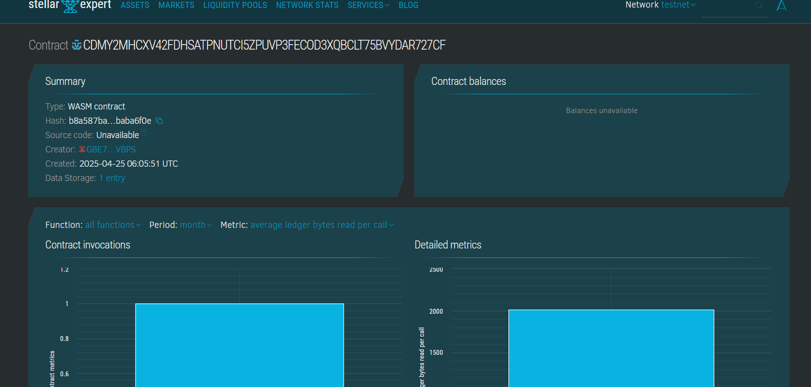

# Weather Prediction App using Machine Learning

## 📌 Project Title
**Weather Prediction App using Machine Learning**

## Project Description
This is a decentralized application (dApp) for recording, retrieving, and updating weather predictions using smart contracts deployed on the Stellar Soroban blockchain. It interfaces with machine learning models that predict weather parameters such as temperature and humidity.

## Project Vision
To provide a secure, tamper-proof platform for publishing and accessing weather predictions that are powered by ML and verifiable via blockchain.

## Key Features
- Secure Data Logging: Records predictions on-chain with timestamps.
- Tamper-Proof Forecasts: Predictions cannot be altered without leaving a trace.
- Real-Time Access: Users can query predictions for any specific date.
- ML-Integrated: Data predictions are generated using machine learning models.

## Future Scope
- Integration with IoT Sensors: Real-time weather data feeds for accurate predictions.
- Advanced Analytics: Support for charts and data visualization.
- Incentivization System: Reward users for accurate predictions.
- Global Coverage: Extend to multi-location weather data management.

